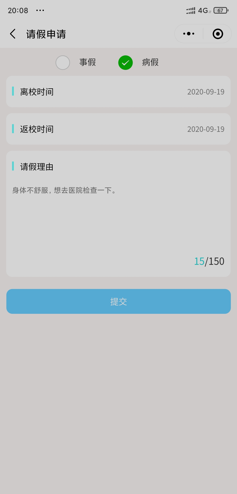

# 项目名称

校园疫情管理小程序

# 项目介绍

## 应用场景
自7月起，多地已经启动了秋季高校返校工作。截至目前，许多大学生已经回到校园，融入正常的校园生活。各高校正逐步恢复教育教学秩序。同时，校园疫情防控常态化也引发了广泛关注。

**#被封闭后的寝室生活#**

**#当代封校大学生的请假理由#**

**#高校应该封闭管理吗#**

这些热搜关键词全方位无死角展现了在众多高校明确“非必要不外出”的当下高校学子的校园生活注定将和“史上最长假期”一起成为大家共同的记忆。
终于盼到9月新学期开学，“非必要，不要外出”一句话却打破了大家对校园生活的幻想。许多高校纷纷出台封闭式管理措施，对返校大学生的校园生活统一进行安排，禁止学生自由进出，仅仅释放教职工等人员进出，学生想要出校必须取得相关负责人的同意。而且对学生进出的校园建筑进行记录。

## 目标用户

被封校管理的在校大学生。

## 实现思路

为了方便被封校管理的大学生的日常出行以及配合校园疫情管理，设计了一款包含请假，体温上报，出行记录等功能的校园疫情管理小程序。

## 架构图

## 效果截图

### 学生端

- 出行记录：通过程序首页扫一扫功能扫描建筑的二维码，会自动保存出行记录

- 请假：可以提交请假申请，获得批准后扫描校门的二维码进出，系统记录进出时间

- 异常上报：可以上传自己或他人的他人的体温异常，或者其他一些违反校园疫情管理规定的相关行为

- 体温上报：学生需每日进行体温测量，并上传测量的体温数值

### 教师端

- 请假审核：教师根据学生上传的请假信息进行审核并查看概览

- 体温概览：可以查看所在学院每天的体温上报情况以及异常体温人员名单

- 异常处理：查看上报的异常

## 代码链接

`https://github.com/173xs/LetMeOut`

## 团队/作者简介

被封闭在校的大学生两枚`X&D`

## 地点名称二维码

上传了部分地点名称二维码，在`data`文件夹